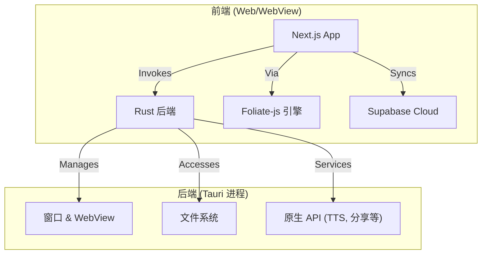

# 架构概述

## 高层设计

Readest 是一个基于混合架构构建的跨平台阅读应用程序。它结合了现代 Web 前端和基于 **Tauri** 的高性能原生后端。



## 技术栈

### 前端

- **框架:** [Next.js 16](https://nextjs.org/) (React 19)
- **样式:** [Tailwind CSS](https://tailwindcss.com/) + DaisyUI
- **状态管理:** [Zustand](https://github.com/pmndrs/zustand)
- **路由:** Next.js App Router (`src/app`)
- **阅读引擎:** 通过 `@readest/foliate-js` 包自定义集成 `foliate-js`。
- **国际化:** `i18next`, `react-i18next`

### 后端 (原生)

- **核心:** [Tauri v2](https://tauri.app/)
- **语言:** Rust (Edition 2021)
- **运行时:** `tokio` 用于异步操作。
- **数据库/同步:** Supabase (主要在客户端使用 `supabase-js`)。

## 仓库结构

该项目是由 **pnpm workspaces** 管理的 Monorepo。

```
.
├── apps/
│   └── readest-app/       # 主应用程序 (Next.js + Tauri)
│       ├── src/           # 前端源代码
│       └── src-tauri/     # 后端 Rust 源代码 & 配置
├── packages/
│   ├── foliate-js/        # 电子书渲染引擎 (wrapper/fork)
│   ├── simplecc-wasm/     # 用于中文转换的 WASM 模块
│   ├── tauri/             # Vendored/Patched Tauri 核心 crates
│   └── tauri-plugins/     # Tauri 插件集 (官方 & 自定义)
├── docs/                  # 项目文档
├── Cargo.toml             # Rust workspace 根
└── package.json           # Node.js workspace 根
```

## 集成细节

### Tauri & Rust

该应用使用了 Tauri v2 的自定义版本，通过 `Cargo.toml` 中的 `[patch.crates-io]` 直接链接到 `packages/tauri` 和 `packages/tauri-plugins` 中的本地 crates。这允许对框架本身进行深度定制。

### 关键插件

应用程序严重依赖 Tauri 插件来实现原生功能：

- **官方:** `fs`, `http`, `shell`, `dialog`, `updater`, `deep-link`, `os`.
- **自定义/本地:**
  - `native-bridge`: 用于特定原生互操作的自定义桥接。
  - `native-tts`: 原生文本转语音集成。
  - `sharekit`: 分享功能。

### 多平台策略

- **桌面 (Windows, macOS, Linux):** 完整的 Tauri 能力，具有文件系统访问权限和原生窗口。
- **移动 (iOS, Android):** 使用 Tauri 移动构建目标。
- **Web:** 可以构建为标准的 Next.js Web 应用程序（原生功能受限）。

## 构建系统

- **Node:** `pnpm` 用于依赖管理和脚本执行。
- **Rust:** 标准 `cargo` 构建流程，通过 `tauri` CLI 触发。
- **脚本:** 在 `package.json` 中定义，通常委托给 `apps/readest-app`。
