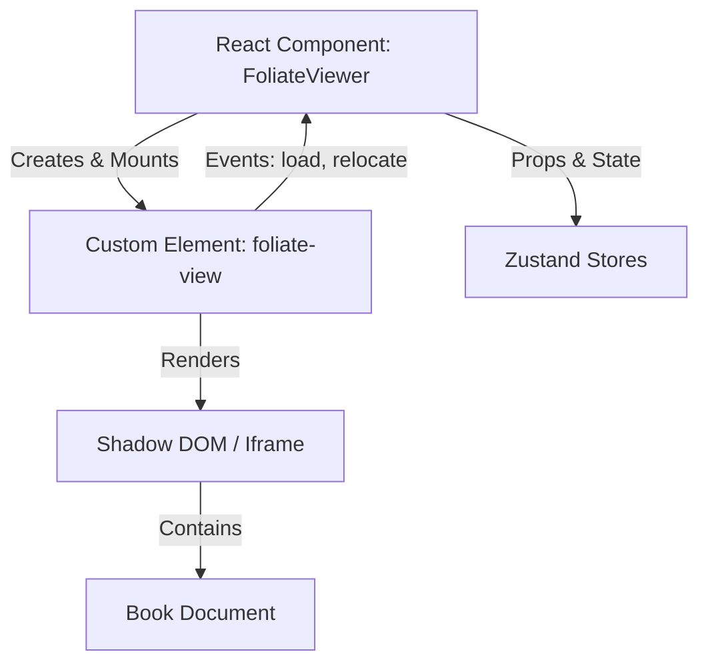

# Foliate-js Integration Analysis

Readest uses `foliate-js` not just as a library, but as a core "Workspace Package" residing in `packages/foliate-js`. This allows for direct modification and optimized building of the rendering engine.

## 1. Architecture: The Custom Element Wrapper

The core integration pattern is **wrapping a Custom Element** (`<foliate-view>`) within a React component (`FoliateViewer.tsx`).



### 1.1 Initialization

The `<foliate-view>` element is dynamically imported from `foliate-js/view.js` and instantiated in `FoliateViewer.tsx`:

```typescript
await import('foliate-js/view.js');
const view = wrappedFoliateView(document.createElement('foliate-view') as FoliateView);
containerRef.current?.appendChild(view);
await view.open(bookDoc);
```

### 1.2 The `wrappedFoliateView` Helper

Located in `src/types/view.ts`, this helper intercepts calls to `addAnnotation` to adapt Readest's `BookNote` data structure to what `foliate-js` expects (specifically mapping `note.cfi` to `value`).

## 2. Event Bridge: `useFoliateEvents`

Communication from the web component to React is handled by the `useFoliateEvents` hook. It standardizes event listeners for:

| Event Name        | Source   | Description                                                                       |
| ----------------- | -------- | --------------------------------------------------------------------------------- |
| `load`            | View     | Triggered when a book section/document is loaded into the view.                   |
| `relocate`        | View     | Triggered when reading progress changes (scrolling/paging). Payload contains CFI. |
| `relocate`        | Renderer | Triggered by the internal renderer (used for managing parallel views).            |
| `draw-annotation` | View     | Fired when the user selects text, requesting the UI to draw the highlight.        |
| `show-annotation` | View     | Fired when a user clicks an existing annotation.                                  |

## 3. Styling & Customization

Foliate-js is highly customizable via attributes and injected CSS.

### 3.1 Renderer Attributes

Readest controls the renderer by setting attributes directly on the `view.renderer` object:

- `animated`: Enables page turn animations.
- `flow`: Set to `scrolled` for continuous scrolling mode.
- `gap`: CSS column gap for multicolumn layout.
- `max-inline-size`: Controls the width of text columns.

### 3.2 Content Transformation

Specific to Readest, the `transformContent` service intercepts document loading to inject:

- **Custom Fonts:** `mountCustomFont` injects `@font-face` rules into the book's document.
- **Theming:** `applyThemeModeClass` adds `.dark` or `.sepia` classes to the book content.
- **Hyphenation/Justification:** Managed via `getStyles(viewSettings)`.

## 4. Book Loading Pipeline

1.  **Importers:** `src/libs/document.ts` dynamically imports format-specific modules (`foliate-js/epub.js`, `pdf.js`, `comic-book.js`) based on file extension.
2.  **Book Object:** These assemblers return a `Book` object that satisfies the `FoliateView.open()` interface.
3.  **Rendering:** The view requests the book content, passing it through the `TransformContext` (for sanitization, punctuation fixing, and generic HTML transformation) before displaying it.

## 5. Key Files

- `apps/readest-app/src/app/reader/components/FoliateViewer.tsx`: Main integration point.
- `apps/readest-app/src/app/reader/hooks/useFoliateEvents.ts`: Event listener abstraction.
- `apps/readest-app/src/types/view.ts`: TypeScript definitions for the `FoliateView` element.
- `packages/foliate-js`: The source code of the engine.

## 6. Migration Guide: Svelte Implementation

If implementing this in Svelte (especially Svelte 5+), the integration becomes significantly cleaner because Svelte handles Custom Elements and imperative DOM updates more natively than React.

### 6.1 Architecture Change

Instead of a `FoliateViewer.tsx` wrapper that fights with React's Virtual DOM, you would create a `FoliateView.svelte` component.

### 6.2 Key Differences

| Feature      | React (`.tsx`)                                | Svelte (`.svelte`)                                |
| ------------ | --------------------------------------------- | ------------------------------------------------- |
| **Mounting** | `useRef` + `useEffect` + `appendChild`        | `bind:this={view}` on the element directly.       |
| **Updates**  | `useEffect` dep arrays to call `setAttribute` | Reactive statements (`$effect` / `$:`).           |
| **Events**   | `useFoliateEvents` hook needed                | Native `on:event` or action (e.g., `use:listen`). |

### 6.3 Implementation Sketch

```svelte
<script lang="ts">
  import { onMount } from 'svelte';
  import { viewSettings } from '$lib/stores/settings'; // Svelte Store

  let viewElement: HTMLElement; // The custom element instance

  onMount(async () => {
    // 1. Dynamic Import (Client-side only)
    await import('foliate-js/view.js');

    // 2. Open Book
    await viewElement.open(bookDoc);
  });

  // 3. Reactivity: Sync Store -> DOM Attributes
  // In Svelte 5 with Runes:
  $effect(() => {
    if (viewElement?.renderer) {
      viewElement.renderer.setAttribute('flow', $viewSettings.scrolled ? 'scrolled' : 'paginated');
      viewElement.renderer.setStyles(getStyles($viewSettings));
    }
  });

  // 4. Event Handling
  function handleRelocate(e) {
    console.log('Progress:', e.detail.cfi);
  }
</script>

<!-- 5. Markup: Direct Custom Element Usage -->
<foliate-view
  bind:this={viewElement}
  on:relocate={handleRelocate}
  on:load={handleLoad}
  class="w-full h-full"
></foliate-view>
```

### 6.4 Advantages in Svelte

1.  **No Refs Hell:** You don't need `useRef` gymnastics to keep track of the view instance; `bind:this` is robust.
2.  **Native Events:** Svelte listens to Custom Event events correctly without needing a bridge hook like `useFoliateEvents`.
3.  **Styles:** Scoped CSS or Tailwind classes can be applied directly to the `<foliate-view>` tag.
