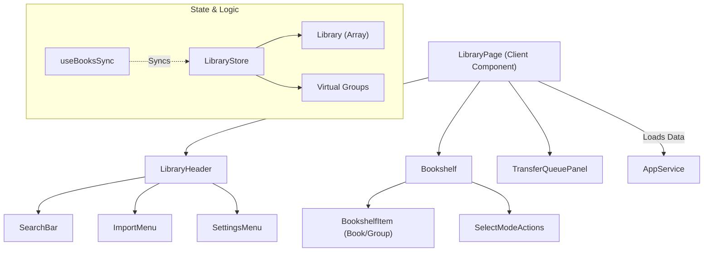

# 书库模块 (Library Module)

书库模块 (`apps/readest-app/src/app/library`) 是用户管理电子书的核心界面，负责书籍的导入、分类、搜索、排序以及云端同步。

## 1. 架构概览

## 2. 状态管理 (`LibraryStore`)

`LibraryStore` 不仅存储书籍列表，还维护了“虚拟分组”的逻辑。

- **数据结构**:
  - `library`: 扁平化的 `Book` 数组。
  - `groups`: 由 `book.groupName` 动态计算得出的路径映射表 (`md5Fingerprint` -> `Path`)。
  - `selectedBooks`: 多选模式下的选中项 ID 集合。
- **虚拟分组 (Virtual Grouping)**:
  Readest 不使用嵌套的数据库表来存储文件夹结构，而是基于文件路径 (如 `Tech/Rust`) 动态生成视图。`refreshGroups` 方法会遍历所有书籍，构建出当前的文件夹层级。

## 3. 核心组件

### 3.1 `LibraryPage` (控制器)

- **数据加载**: 初始化时调用 `appService.loadLibraryBooks()`。
- **URL 同步**: 将当前的 `group`, `sort`, `view` 等状态同步到 URL Search Params，支持浏览器后退/前进导航。
- **拖拽导入**: 集成 `useDragDropImport`，支持拖拽文件到窗口直接导入。
- **全局交互**: 监听快捷键 (如 `Cmd+O` 打开文件)，处理 `OpenWith` (从系统文件管理器打开) 逻辑。

### 3.2 `Bookshelf` (视图层)

- **数据过滤与排序**:
  - 使用 `useMemo` 根据搜索关键词 (`queryTerm`) 过滤书籍。
  - 根据 `sortBy` (添加时间、阅读进度、标题) 和 `sortOrder` 对结果进行排序。
  - 将扁平的书籍列表转换为包含“文件夹”和“书籍”的混合列表 (`generateBookshelfItems`)。
- **布局模式**: 支持 `Grid` (网格) 和 `List` (列表) 两种视图，响应式调整列数。
- **多选操作**: 提供批量删除、批量移动分组 (`GroupingModal`)、批量导出等功能。

### 3.3 `LibraryHeader` (工具栏)

- **搜索**: 包含防抖 (`debounce`) 的实时搜索框。
- **菜单集成**:
  - `ImportMenu`: 导入本地文件、文件夹或从 OPDS 目录下载。
  - `ViewMenu`: 切换排序方式、封面显示模式 (填充/适应)。
  - `SettingsMenu`: 快速访问全局设置。

## 4. 关键流程

### 4.1 书籍导入 (`importBooks`)

1.  用户选择文件或拖拽文件。
2.  调用 `appService.importBook` 解析元数据 (封面、标题、作者)。
3.  如果配置了 `autoUpload`，自动将新书加入 `TransferManager` 上传队列。
4.  更新 `LibraryStore` 并持久化到本地数据库 (`IndexedDB` 或 `JSON`)。

### 4.2 云端同步 (`useBooksSync`)

- **Pull**: 定期或手动触发，从 Supabase 拉取最新的书籍元数据变更 (如阅读进度、分组修改)。
- **Push**: 本地发生变更 (导入、删除、修属性) 后，立即推送到云端。
- **冲突解决**: 依赖 `updatedAt` 时间戳进行简单的最后写入胜出策略 (LWW)。

### 4.3 虚拟分组导航

用户点击文件夹时，实际上是更新了 URL 中的 `?group=HASH_ID`。`LibraryPage` 监听到 URL 变化，通过 `getGroupName(hash)`以此筛选出 `groupName` 匹配该路径的所有书籍。
