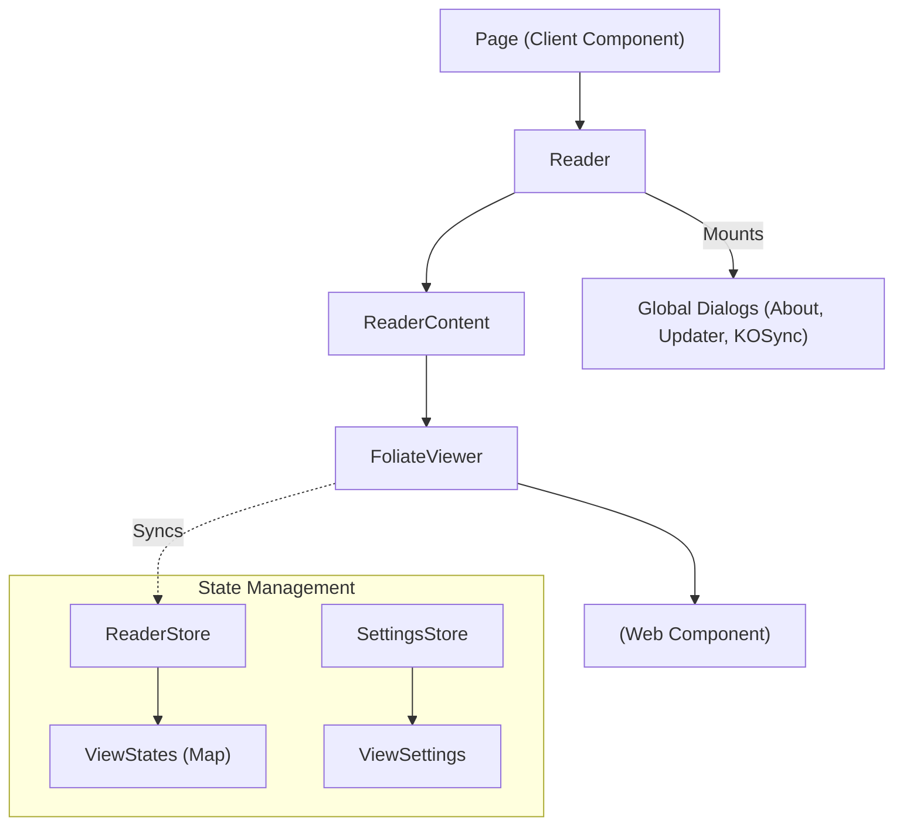

# 阅读器核心模块 (Reader Core Module)

阅读器模块 (`apps/readest-app/src/app/reader`) 是应用最核心的业务单元，负责电子书的加载、渲染、交互与状态管理。

## 1. 架构概览

## 2. 状态管理 (`ReaderStore`)

Readest 支持多窗口/多标签页阅读，因此 `ReaderStore` 不维护单一状态，而是维护一个 `viewStates` 字典。

- **Key**: 唯一标识符，通常为 `BookHash` 或 `BookHash-Timestamp` (多开时)。
- **ViewState**:
  - `view`: `FoliateView` 实例的引用。
  - `progress`: 当前阅读进度 (CFI, Percentage, Section)。
  - `viewSettings`: 针对该窗口的视图配置 (Font, Theme, Margin)，优先级高于全局设置。
- **Actions**:
  - `initViewState`: 异步加载 `BookContent` (ArrayBuffer) 和 `BookConfig` (用户配置)。
  - `setProgress`: 当页面滚动时触发，同时更新 `LibraryStore` 中的阅读百分比。

## 3. 组件层级

### 3.1 `Reader.tsx` (布局控制器)

负责整体界面的**层级管理 (Z-Index)** 与**系统级交互**。

- **Z-Index 定义**: 明确了 Menu (20), TTS Control (30/40), Global Dialogs (50) 的覆盖关系。
- **System UI**: 根据 `themeStore` 控制移动端状态栏的沉浸式显隐。
- **Back Key**: 拦截安卓物理返回键，处理 Sidebar/Notebook 的关闭逻辑。
- **Global Components**: 挂载 `Toast`, `AboutWindow` 等全局单例组件。

### 3.2 `FoliateViewer.tsx` (渲染引擎封装)

这是 React 与 `foliate-js` Web Component 的桥接层。

- **生命周期**:
  1.  `import('foliate-js/view.js')`: 动态导入渲染引擎。
  2.  `view.open(bookDoc)`: 加载解析后的书籍文档。
  3.  `mountCustomFont` / `applyUICSS`: 在 `docLoadHandler` 中注入用户字体和样式。
- **Hooks 集成**:
  - `useProgressSync`: 监听 `relocate` 事件并防抖更新 Store。
  - `useKOSync`: 处理多端进度的冲突解决。
  - `useAutoSaveBookCover`: 自动导出封面。
  - `useIframeEvents`: 将 iframe 内的鼠标/触摸事件转发回 React 层处理翻页。
- **布局计算**: 动态计算 `margin` 和 `gap`，处理 Header/Footer 留白 (`insets`)。

## 4. 关键特性实现

### 4.1 样式注入

为了让 Web Component 内部的 Shadow DOM 或 iframe 受控，Readest 使用 `view.renderer.setStyles` 注入生成的 CSS 变量：

- `--USER-FONT-FAMILY`: 用于覆盖正文字体。
- `--USER-LINE-HEIGHT`: 用于排版调整。
- `custom-css`: 用户编写的 CSS 代码直接注入到文档流。

### 4.2 事件穿透

由于 iframe 隔离了事件，`iframeEventHandlers.ts` 在 iframe 内部捕获 `keydown`, `click`, `wheel` 等事件，通过 `postMessage` 发送给主线程。`Reader` 组件通过监听这些消息来实现统一的快捷键响应 (如 `Arrow keys` 翻页)。
