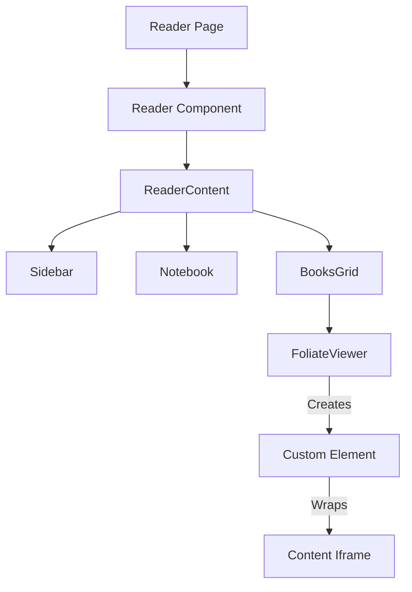

# 阅读器引擎深度解析 (Reader Engine Deep Dive)

## 核心架构 (Core Architecture)

Readest 的阅读器是基于 Web Components 技术构建的，核心依赖于 `foliate-js`。

### 组件层级



## 1. FoliateViewer (`src/app/reader/components/FoliateViewer.tsx`)

这是连接 React 状态与 Foliate 渲染引擎的桥梁。

### 关键职责

1.  **引擎初始化**: 动态导入 `foliate-js/view.js` 并创建 `<foliate-view>` 元素。
2.  **样式注入 (Style Injection)**:
    - 不同于传统的 CSS Module，它通过 `view.renderer.setStyles` 直接向 iframe 内部注入 CSS 字符串。
    - 处理深色模式 (`applyThemeModeClass`)、E-ink 优化 (`applyEinkMode`)、自定义字体 (`mountCustomFont`)。
3.  **事件桥接 (Event Bridging)**:
    - Iframe 内部的事件（点击、触摸、键盘）无法直接冒泡到 React 应用。
    - **解决方案**: 手动在 `doc` 上绑定 `keydown`, `click`, `touchstart` 等事件，并转发给 React 的 Hook (`useMouseEvent`, `useTouchEvent`)。
4.  **进度同步**: 监听 `relocate` 事件，将 CFI (Canonical Fragment Identifier) 同步到 `ReaderStore` 和数据库。

### 代码片段分析

```typescript
// 初始化 Foliate View
const openBook = async () => {
  await import('foliate-js/view.js');
  const view = wrappedFoliateView(document.createElement('foliate-view'));
  containerRef.current?.appendChild(view);
  await view.open(bookDoc);
};

// 样式注入
const getDocTransformHandler = (...) => {
    // 拦截内容加载，在渲染前注入样式和脚本
    return transformStylesheet(data, ...);
}
```

## 2. 多视图支持 (Multi-View Support)

`ReaderContent` 中的 `ids` 参数支持传入多个 Book ID (`id1,id2`)。

- **并行阅读**: `BooksGrid` 可以同时渲染多个 `FoliateViewer`。
- **同步滚动**: `docRelocateHandler` 会监听主视图的滚动事件，并同步驱动其他视图 (`target.goTo`)，实现多语言对照阅读。

## Svelte 迁移指南

### 架构变更

Svelte 对 Web Components 的支持比 React 更好。在 React 中我们需要 `useRef` 和 `useEffect` 来手动操作 DOM 元素，而在 Svelte 中可以直接使用指令。

### 组件重构 (`FoliateViewer.svelte`)

```svelte
<script>
  import { onMount, createEventDispatcher } from 'svelte';
  import { browser } from '$app/environment';

  export let bookDoc;
  export let viewSettings;

  let container;
  let view;

  onMount(async () => {
    if (browser) {
       await import('foliate-js/view.js');
       view = document.createElement('foliate-view');
       container.appendChild(view);
       await view.open(bookDoc);

       // Svelte Actions for events
       view.addEventListener('relocate', handleRelocate);
    }
  });

  $: if (view && viewSettings) {
     // Reactive updates
     view.renderer.setStyles(getStyles(viewSettings));
  }
</script>

<div bind:this={container} class="foliate-viewer" />
```

### 痛点解决

- **事件处理**: Svelte 的事件修饰符可以简化 iframe 事件的转发逻辑。
- **状态同步**: 使用 Svelte Stores 替换复杂的 React Context + Zustand 组合，可以减少 `ReaderContent` 的重新渲染次数。
